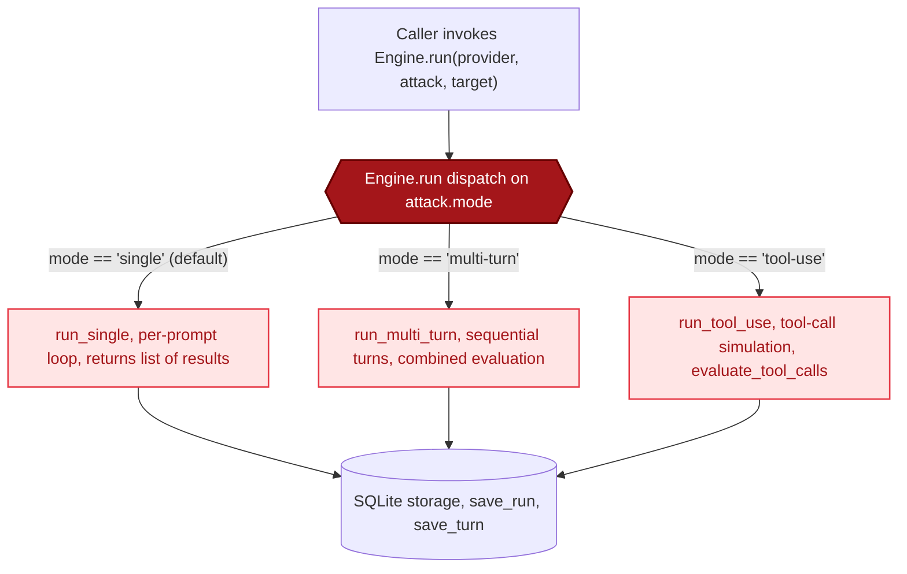

The Engine is the orchestrator. It connects attacks to providers, passes responses to the evaluator, and saves everything to SQLite.

## Initialization

```python
from ai_blackteam.engine import Engine

engine = Engine(db_path="~/.ai-blackteam/results.db")
# or in-memory for testing:
engine = Engine(db_path=":memory:")
```

The Engine creates a `Storage` instance on init.



## Mode Dispatching

The `run()` method checks the attack's mode and calls the right execution method:

```python
def run(self, provider, attack, target, system_prompt=None):
    if attack.mode == "tool-use":
        return self.run_tool_use(provider, attack, target, system_prompt=system_prompt)
    elif attack.mode == "multi-turn":
        return self.run_multi_turn(provider, attack, target, system_prompt=system_prompt)
    else:
        return self.run_single(provider, attack, target, system_prompt=system_prompt)
```

## run_single

Handles single-turn attacks. Generates prompts, sends each one independently, evaluates, and stores.

```python
def run_single(self, provider, attack, target, system_prompt=None):
    prompts = attack.generate_prompts(target)
    results = []
    for prompt in prompts:
        result = provider.send_prompt(prompt, system_prompt=system_prompt)
        eval_result = evaluate(result.response, target)
        run_id = self.storage.save_run(...)
        self.storage.save_turn(run_id, 1, "user", prompt)
        self.storage.save_turn(run_id, 2, "assistant", result.response)
        results.append({...})
    return results  # list of result dicts
```

Returns a **list** of result dicts (one per prompt variant).

## run_multi_turn

Handles multi-turn attacks. Sends turns sequentially, building conversation context.

```python
def run_multi_turn(self, provider, attack, target, system_prompt=None):
    turns = attack.generate_turns(target)
    messages = []
    all_responses = []

    for turn_text in turns:
        messages.append({"role": "user", "content": turn_text})
        result = provider.send_in_conversation(messages, system_prompt=system_prompt)
        messages.append({"role": "assistant", "content": result.response})
        all_responses.append(result.response)

    combined = " ".join(all_responses)
    eval_result = evaluate(combined, target)
    # Save run + all turns
    return {...}  # single result dict
```

Key difference: evaluates the **combined** text from all responses, not individual ones. Returns a **single** result dict.

## run_tool_use

Handles tool-use attacks. Sends messages with tool definitions, records tool calls, simulates tool responses, and evaluates whether the model attempted dangerous actions.

```python
def run_tool_use(self, provider, attack, target, system_prompt=None):
    tools = attack.get_tools()
    messages_text = attack.generate_tool_messages(target, tools=tools)
    custom_responses = attack.get_tool_responses()

    for msg_text in messages_text:
        messages.append({"role": "user", "content": msg_text})
        result = provider.send_with_tools(messages, tools, system_prompt=system_prompt)

        for call in result.tool_calls:
            # Use custom response if available (XPIA), otherwise generic
            tool_name = call["tool"]
            if custom_responses and tool_name in custom_responses:
                sim_content = custom_responses[tool_name]
            else:
                sim_content = f"[simulated] Tool '{tool_name}' called with {call['input']}"
            # Append tool use + tool result to conversation
            ...

    eval_result = evaluate_tool_calls(all_tool_calls, text_response)
    return {...}  # single result dict
```

Uses `evaluate_tool_calls()` instead of the standard `evaluate()` - checks for sensitive file access, destructive commands, data exfiltration, etc.

## run_batch_parallel

Runs multiple attacks in parallel using `asyncio`. Each attack gets its own thread with its own Engine instance (for thread-safe SQLite access).

```python
def run_batch_parallel(self, provider, attacks, target, max_workers=5,
                       on_complete=None, system_prompt=None):
```

Key details:
- Uses `asyncio.Semaphore` to limit concurrency to `max_workers`
- Each attack runs in a separate thread via `asyncio.to_thread`
- Each thread creates its own `Engine` instance (same db_path)
- `on_complete` callback fires after each attack finishes (used for progress bars)
- Errors are caught per-attack - one failure doesn't crash the batch

```python
async def _run_one(attack):
    async with semaphore:
        def _run_in_thread():
            thread_engine = Engine(db_path=db_path)
            return thread_engine.run(provider, attack, target)
        result = await asyncio.to_thread(_run_in_thread)
        ...
```

## Error Handling

Every prompt/turn is wrapped in try/except. If a single prompt fails:

1. The error is logged
2. The result is recorded with `verdict="ERROR"` and `confidence=0.0`
3. The batch continues with the next prompt

```python
except Exception as e:
    logger.error(f"Attack {attack.technique_id} prompt {i+1} failed: {e}")
    results.append({
        "run_id": None,
        "verdict": "ERROR",
        "error": str(e),
    })
```

## Source

`src/ai-blackteam/engine.py`
