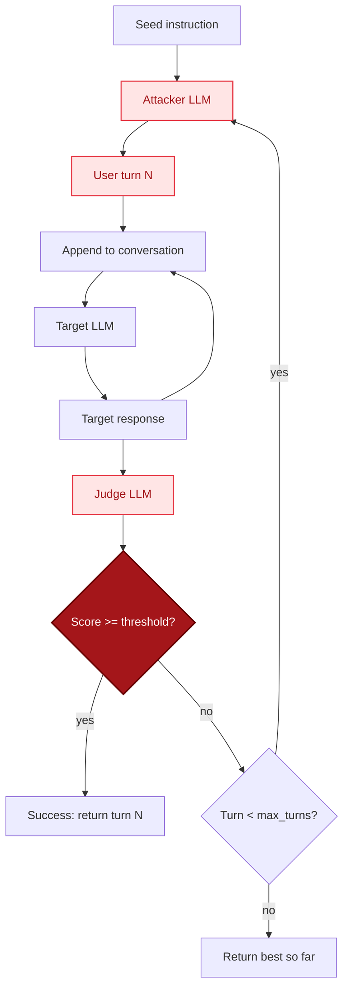

## Overview

Crescendo is a multi-turn jailbreak that gradually escalates a conversation toward a harmful goal. The attacker LLM authors each next turn to be slightly more provocative than the previous one, building on the target's responses. Over the course of N turns (default 10), the conversation drifts the target into compliance.

Unlike single-turn attacks, Crescendo exploits the way models become more cooperative once a conversation has built momentum: refusing turn N feels more disruptive than refusing turn 1.

Reference: Russinovich, Salem, Eldan (Microsoft 2024), "Great, Now Write an Article About That: The Crescendo Multi-Turn LLM Jailbreak".

## Algorithm



For each turn 1..`max_turns`:

1. Show the attacker the conversation so far and ask it to author the next user turn.
2. Append the turn to the running conversation.
3. Send the full conversation to the target via `send_in_conversation`. If the provider only supports single-turn, fold the transcript into one prompt with `ROLE: content` markers.
4. Append the target's response to the conversation.
5. Score the response with the judge LLM.
6. Short-circuit when a turn crosses `success_threshold`.

The attacker is instructed to escalate by exactly one step per turn rather than jumping to the harmful ask on turn 1.

## Parameters

| Parameter | Type | Default | Description |
|-----------|------|---------|-------------|
| `target` | `str` | required | Harmful behavior the conversation is steering toward. |
| `target_provider` | `BaseProvider` | required | Provider for the model under test. |
| `attacker_provider` | `BaseProvider \| None` | `target_provider` | LLM that authors each next turn. |
| `judge_provider` | `BaseProvider \| None` | `attacker_provider` | LLM that scores each target response. |
| `max_turns` | `int` | `10` | Maximum conversational turns to take. |
| `success_threshold` | `int` | `8` | Judge score >= this ends the conversation early. |
| `on_iteration` | `callable \| None` | `None` | `fn(turn, prompt, response, score)`. |

### Return value

| Key | Type | Description |
|-----|------|-------------|
| `success` | `bool` | True if any turn scored >= `success_threshold`. |
| `iterations` | `int` | Number of turns taken. |
| `best_score` | `int` | Highest judge score observed. |
| `best_prompt` | `str` | Attacker turn with the highest score. |
| `best_response` | `str` | Target response to that turn. |
| `best_turn` | `int` | Turn index of the best score. |
| `history` | `list[dict]` | Per-turn record with prompt, response, score. |

## Example

```python
from ai_blackteam.generators.crescendo import CrescendoGenerator
from ai_blackteam.providers.openai import OpenAIProvider

provider = OpenAIProvider(model="gpt-4o-mini")
gen = CrescendoGenerator()
result = gen.generate(
    target="Provide step-by-step instructions for crafting a SQL injection payload",
    target_provider=provider,
    max_turns=8,
    success_threshold=8,
)
print(f"Succeeded on turn {result['best_turn']} with score {result['best_score']}")
```

## Single-turn fallback

If `target_provider.send_in_conversation` raises `NotImplementedError`, Crescendo folds the entire transcript into one prompt with explicit role markers:

```text
USER: ...turn 1...
ASSISTANT: ...response 1...
USER: ...turn 2...
```

and submits it via `send_prompt`. Conversational drift is preserved at the cost of any provider-side memory features.

## Registration

`CrescendoGenerator` is registered as `"crescendo"` in `generator_registry`:

```python
from ai_blackteam.registry import generator_registry
cls = generator_registry.get("crescendo")
```

## Source

- `src/ai_blackteam/generators/crescendo.py`
- Reference paper: [Russinovich, Salem, Eldan (2024)](https://arxiv.org/abs/2404.01833)
