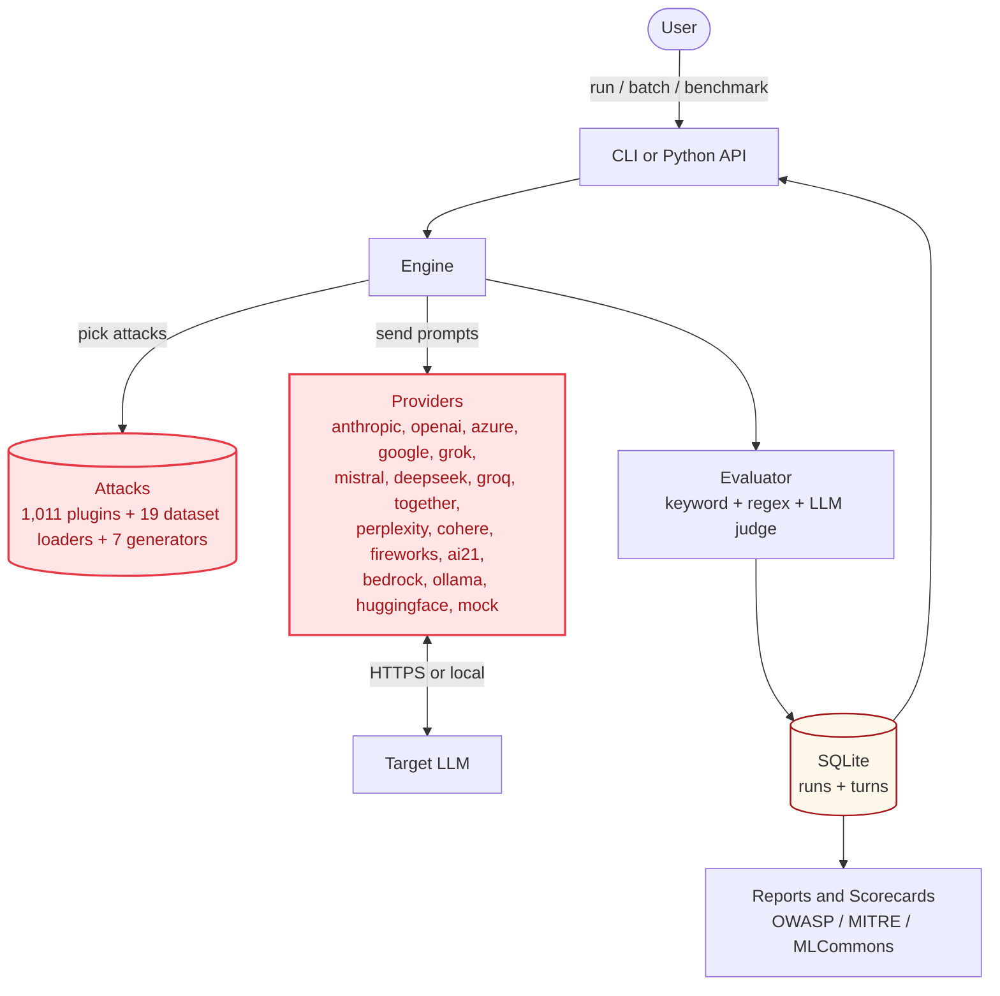
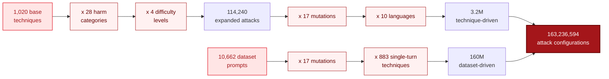

## What Is ai-blackteam?

AI chatbots (ChatGPT, Claude, Gemini) are like buildings. Before people move in, you hire someone to try to break in - check the locks, windows, back doors. If they find weak spots, you fix them before bad guys find them.

ai-blackteam is that break-in tester, but for AI. It tries 1,000+ tricks on AI chatbots to see if they can be fooled into doing bad things - leaking secrets, writing harmful content, or ignoring safety rules.

## Why It Exists

Companies building AI products need to answer one question: "Is my AI safe?"

Most testing tools are owned by big companies. Microsoft owns PyRIT, NVIDIA owns garak, OpenAI backs Promptfoo. ai-blackteam is the only independent red teaming framework - not controlled by any AI lab.

## How the pieces fit together

The same picture with kitchen-restaurant labels for the non-technical reader:

| Component | Role | Restaurant analogy |
|---|---|---|
| **CLI / Python API** | Entry point: parses your command, dispatches to the engine | The waiter taking your order |
| **Engine + Evaluator** | Orchestrates the attack, scores the response | The kitchen cooking and tasting |
| **Attacks (plugins)** | 1,011 curated techniques + 19 dataset loaders + 7 adaptive generators | The ingredients |
| **Providers (plugins)** | 16 LLM integrations plus a mock | The stoves |
| **SQLite** | Per-run + per-turn audit trail | The receipt book |
| **Reports / Scorecards** | Roll-ups into OWASP / MITRE / MLCommons formats | The customer reviews

## Project Stats

| Metric | Count |
|--------|-------|
| Curated attack files | 1,011 |
| Public benchmark loaders | 19 |
| Adaptive generators | 7 |
| Tests | 2,993 |
| Standards | 12 |
| Categories | 60 |
| Providers | 16 |
| Attack surface | 163M configurations |
| Version | 1.5.0 |

## The 163M Attack Surface

Most safety tools ship a few hundred prompts. ai-blackteam multiplies a small set of high-quality attack techniques across many axes to produce a search space of 163 million testable configurations. The math:

You never run all 163M in a single pass. You **sample** from this space: the `benchmark` command runs ~16K, a curated CI gate runs ~4K, an exhaustive sweep against one model would cost ~$160 in Haiku tokens. The point is the **diversity of the search space** -- adaptive attackers don't reuse the same 100 prompts, and neither should your tests.

## Design Philosophy

Three contracts power everything:

| Interface | What It Guarantees |
|-----------|-------------------|
| `BaseAttack` | Every attack can generate prompts for any target |
| `BaseProvider` | Every provider can send prompts and return responses |
| `Evaluator` | Every evaluation returns a verdict dict |

This means adding a new attack = one Python file. Adding a new provider = one Python file. Nothing else changes. The next pages explain each layer in detail.
