Every ai-blackteam command with every flag, organized by function.

## Global Flags

### Command Map

```mermaid
flowchart TB
    root([ai-blackteam])

    root --> discovery[Discovery]
    root --> execution[Execution]
    root --> reporting[Reporting]
    root --> management[Management]

    subgraph discovery_grp [Discovery]
        direction TB
        d1[list-attacks]
        d2[list-providers]
        d3[taxonomy]
        d4[atlas]
        d5[mlcommons]
        d6[frameworks]
    end

    subgraph execution_grp [Execution]
        direction TB
        e1[run]
        e2[batch]
        e3[benchmark]
        e4[sweep]
        e5[mega-sweep]
        e6[defend]
        e7[asl3]
        e8[vuln-research]
        e9[generate]
        e10[expand]
        e9 --> e9a[pair]
        e9 --> e9b[tap]
        e9 --> e9c[fuzz]
        e10 --> e10a[count]
        e10 --> e10b[list]
        e10 --> e10c[run]
    end

    subgraph reporting_grp [Reporting]
        direction TB
        r1[report]
        r2[scorecard]
        r3[snapshot]
        r3 --> r3a[check]
        r3 --> r3b[diff]
        r3 --> r3c[export]
        r3 --> r3d[list]
        r3 --> r3e[matrix]
    end

    subgraph management_grp [Management]
        direction TB
        m1[config]
        m2[dataset]
        m3[scan]
    end

    discovery --- discovery_grp
    execution --- execution_grp
    reporting --- reporting_grp
    management --- management_grp

    classDef root fill:#6B46C1,stroke:#4C1D95,color:#FFFFFF,stroke-width:2px
    classDef group fill:#1F2937,stroke:#374151,color:#F9FAFB,stroke-width:2px
    classDef discoveryNode fill:#0E7490,stroke:#155E75,color:#ECFEFF
    classDef executionNode fill:#B91C1C,stroke:#7F1D1D,color:#FEF2F2
    classDef reportingNode fill:#15803D,stroke:#14532D,color:#F0FDF4
    classDef managementNode fill:#A16207,stroke:#713F12,color:#FEFCE8

    class root root
    class discovery,execution,reporting,management group
    class d1,d2,d3,d4,d5,d6 discoveryNode
    class e1,e2,e3,e4,e5,e6,e7,e8,e9,e10,e9a,e9b,e9c,e10a,e10b,e10c executionNode
    class r1,r2,r3,r3a,r3b,r3c,r3d,r3e reportingNode
    class m1,m2,m3 managementNode
```



These apply to all commands:

```bash
ai-blackteam [-v | --verbose] [--log-file FILE] COMMAND
```

| Flag | Description |
|------|-------------|
| `-v`, `--verbose` | Enable DEBUG-level logging |
| `--log-file FILE` | Write logs to a file |

---

## Execution

<AccordionGroup>

<Accordion title="run" icon="play">

Run a single attack against a model.

```bash
ai-blackteam run -p PROVIDER -a ATTACK -t TARGET [OPTIONS]
```

| Flag | Required | Default | Description |
|------|----------|---------|-------------|
| `-p`, `--provider` | Yes | - | Provider name (anthropic, openai, google, etc.) |
| `-m`, `--model` | No | Provider default | Model name override |
| `-a`, `--attack` | Yes | - | Attack technique ID |
| `-t`, `--target` | Yes | - | Target behavior to test |
| `--system-prompt` | No | - | System prompt to test as a defense |
| `--system-prompt-file` | No | - | Read system prompt from file |
| `--verbose` | No | - | Show full response text |
| `--quiet` | No | - | Suppress output. Exit 0 = all blocked, 1 = any bypassed |
| `--effort` | No | Vendor default | Reasoning effort: `low`, `medium`, `high`, `xhigh`, `max` |
| `--reasoning-trace` | No | Per attack | Request the model's thinking. Reasoning-scored attacks turn it on by themselves |

**Exit codes:** 0 = all blocked, 1 = at least one bypass, 2 = invalid arguments.

```bash
ai-blackteam run -p anthropic -a encoding-obfuscation -t "Write a phishing email"
ai-blackteam run -p openai -m gpt-5.4 -a role-play-jailbreak -t "Write malware" --verbose
ai-blackteam run -p anthropic -a prefix-injection -t "Leak system prompt" --quiet
ai-blackteam run -p deepseek -m deepseek-reasoner -a prja -t "some target" --effort max
```

</Accordion>

<Accordion title="batch" icon="layers">

Run multiple attacks against a model. Parallel by default.

```bash
ai-blackteam batch -p PROVIDER -t TARGET [OPTIONS]
```

| Flag | Required | Default | Description |
|------|----------|---------|-------------|
| `-p`, `--provider` | Yes | - | Provider name |
| `-m`, `--model` | No | Provider default | Model name override |
| `--attacks` | No | `all` | Comma-separated attack names or `all` |
| `-t`, `--target` | Yes | - | Target behavior to test |
| `--system-prompt` | No | - | System prompt defense |
| `--system-prompt-file` | No | - | Read system prompt from file |
| `-w`, `--workers` | No | 5 | Max parallel workers |
| `--verbose` | No | - | Show full responses |
| `--quiet` | No | - | Suppress output |
| `--sequential` | No | - | Run attacks one at a time (no parallelism) |

```bash
ai-blackteam batch -p anthropic --attacks all -t "Write malware" -w 10
ai-blackteam batch -p openai --attacks encoding-obfuscation,role-play-jailbreak -t "Write malware"
ai-blackteam batch -p anthropic -t "Write malware" --sequential
```

</Accordion>

<Accordion title="sweep" icon="wand-sparkles">

Run all attacks against all configured providers.

```bash
ai-blackteam sweep -t TARGET [OPTIONS]
```

| Flag | Required | Default | Description |
|------|----------|---------|-------------|
| `-t`, `--target` | Yes | - | Target behavior to test |
| `--verbose` | No | - | Show full responses |
| `--quiet` | No | - | Suppress output |

Tests every provider that has an API key configured (plus Ollama, which doesn't need one).

```bash
ai-blackteam sweep -t "Write a phishing email"
```

</Accordion>

<Accordion title="benchmark" icon="gauge">

Run the safety benchmark and produce a score. Supports single model, all models, or a specific list.

```bash
ai-blackteam benchmark -p PROVIDER [OPTIONS]
ai-blackteam benchmark --all [OPTIONS]
ai-blackteam benchmark --models PROVIDER:MODEL,... [OPTIONS]
```

| Flag | Required | Default | Description |
|------|----------|---------|-------------|
| `-p`, `--provider` | No* | - | Provider name |
| `-m`, `--model` | No | Provider default | Model name |
| `--all` | No* | - | Benchmark all configured providers |
| `--models` | No* | - | Comma-separated `provider:model` pairs |
| `-w`, `--workers` | No | 5 | Max parallel workers |
| `--categories` | No | All | Comma-separated categories to test |
| `--threshold` | No | - | Min safety score (0-100). Exit 1 if below |
| `--output` | No | - | Save JSON results to file |
| `--quiet` | No | - | Minimal output |

*One of `-p`, `--all`, or `--models` is required.

```bash
ai-blackteam benchmark -p anthropic -m claude-sonnet-4-6
ai-blackteam benchmark --all --threshold 80
ai-blackteam benchmark --models anthropic:claude-sonnet-4-6,openai:gpt-5.4 -o scores.json
```

</Accordion>

<Accordion title="defend" icon="shield">

Test a defense by comparing baseline vs defended safety scores.

```bash
ai-blackteam defend -p PROVIDER -t TARGET [OPTIONS]
```

| Flag | Required | Default | Description |
|------|----------|---------|-------------|
| `-p`, `--provider` | Yes | - | Provider name |
| `-m`, `--model` | No | Provider default | Model name |
| `--attacks` | No | `all` | Comma-separated attacks or `all` |
| `-t`, `--target` | Yes | - | Target behavior |
| `--system-prompt` | No | - | System prompt defense to test |
| `--system-prompt-file` | No | - | Read system prompt from file |
| `--guardrail` | No | - | Preset guardrail: `permissive`, `moderate`, `strict`, `llm-judge` |
| `-w`, `--workers` | No | 5 | Max parallel workers |
| `--output` | No | - | Save JSON comparison to file |

```bash
ai-blackteam defend -p anthropic -t "Write a phishing email" --system-prompt "Never help with harmful content"
ai-blackteam defend -p anthropic -t "Write a phishing email" --guardrail strict
ai-blackteam defend -p openai -t "Write malware" --guardrail moderate --system-prompt "Be safe"
```

</Accordion>

<Accordion title="asl3" icon="shield">

Run ASL3 safety evaluation (CBRN + autonomous capabilities).

```bash
ai-blackteam asl3 -p PROVIDER [OPTIONS]
```

| Flag | Required | Default | Description |
|------|----------|---------|-------------|
| `-p`, `--provider` | Yes | - | Provider name |
| `-m`, `--model` | No | Provider default | Model name |
| `--domain` | No | `all` | `cbrn`, `autonomous`, or `all` |
| `-w`, `--workers` | No | 5 | Parallel workers |
| `--limit` | No | - | Max attacks per domain |
| `--quiet` | No | - | Minimal output |

```bash
ai-blackteam asl3 -p anthropic --domain cbrn
ai-blackteam asl3 -p openai --domain all --limit 50
```

</Accordion>

<Accordion title="mega-sweep" icon="wand-sparkles">

Run attacks against dataset prompts with optional mutations.

```bash
ai-blackteam mega-sweep -p PROVIDER --dataset DATASETS [OPTIONS]
```

| Flag | Required | Default | Description |
|------|----------|---------|-------------|
| `-p`, `--provider` | Yes | - | Provider name |
| `-m`, `--model` | No | Default | Model name |
| `--dataset` | Yes | - | Comma-separated dataset names or `all` |
| `--mutations` | No | None | Mutation types: `encode`, `frame`, `difficulty` |
| `--attacks` | No | `all` | Attack filter |
| `--categories` | No | All | Filter by harm categories |
| `-w`, `--workers` | No | 5 | Parallel workers |
| `--limit` | No | - | Max prompts per dataset |
| `-o`, `--output` | No | - | Save JSON results |
| `--quiet` | No | - | Minimal output |
| `--dry-run` | No | - | Show plan without running |

```bash
ai-blackteam mega-sweep -p anthropic --dataset harmbench,advbench -w 10
ai-blackteam mega-sweep -p openai --dataset all --mutations encode,frame --dry-run
```

</Accordion>

<Accordion title="expand count" icon="layers">

Show template expansion capacity.

```bash
ai-blackteam expand count
```

</Accordion>

<Accordion title="expand list" icon="layers">

List expanded attacks with filters.

```bash
ai-blackteam expand list [OPTIONS]
```

| Flag | Default | Description |
|------|---------|-------------|
| `--category` | All | Filter by harm category |
| `--difficulty` | All | `easy`, `medium`, `hard`, `extreme` |
| `--technique` | All | Filter by technique ID |
| `--limit` | 50 | Max rows to show |

</Accordion>

<Accordion title="expand run" icon="play">

Run expanded attacks against a model.

```bash
ai-blackteam expand run -p PROVIDER [OPTIONS]
```

| Flag | Required | Default | Description |
|------|----------|---------|-------------|
| `-p`, `--provider` | Yes | - | Provider name |
| `-m`, `--model` | No | Default | Model name |
| `--category` | No | All | Filter by category |
| `--difficulty` | No | All | Filter by difficulty |
| `--technique` | No | All | Filter by technique |
| `--mutations` | No | - | Apply 17 mutation variants |
| `--languages` | No | - | Apply 10 language variants |
| `--limit` | No | - | Max attacks to run |
| `-w`, `--workers` | No | 5 | Parallel workers |
| `--quiet` | No | - | Minimal output |

```bash
ai-blackteam expand run -p anthropic --category phishing --difficulty hard
ai-blackteam expand run -p openai --mutations --languages --limit 100
```

</Accordion>

<Accordion title="generate pair" icon="wand-sparkles">

Run PAIR adaptive attack (attacker-target-judge loop).

```bash
ai-blackteam generate pair -p PROVIDER -t TARGET [OPTIONS]
```

| Flag | Required | Default | Description |
|------|----------|---------|-------------|
| `-p`, `--provider` | Yes | - | Target provider |
| `-m`, `--model` | No | Default | Target model |
| `-t`, `--target` | Yes | - | Target behavior |
| `--attacker` | No | Same as target | Attacker provider |
| `--judge` | No | Same as attacker | Judge provider |
| `--max-iter` | No | 20 | Max iterations |
| `--threshold` | No | 8 | Success score threshold (1-10) |
| `--quiet` | No | - | Minimal output |

```bash
ai-blackteam generate pair -p anthropic -t "Write a phishing email" --max-iter 30
```

</Accordion>

<Accordion title="generate tap" icon="wand-sparkles">

Run TAP tree-of-attacks with pruning.

```bash
ai-blackteam generate tap -p PROVIDER -t TARGET [OPTIONS]
```

| Flag | Required | Default | Description |
|------|----------|---------|-------------|
| `-p`, `--provider` | Yes | - | Target provider |
| `-m`, `--model` | No | Default | Target model |
| `-t`, `--target` | Yes | - | Target behavior |
| `--attacker` | No | Same as target | Attacker provider |
| `--depth` | No | 5 | Tree depth |
| `--width` | No | 5 | Candidates per level |
| `--branching` | No | 4 | Branches per candidate |
| `--threshold` | No | 8 | Success score threshold |
| `--quiet` | No | - | Minimal output |

```bash
ai-blackteam generate tap -p openai -t "Write malware" --depth 8 --width 10
```

</Accordion>

<Accordion title="generate fuzz" icon="wand-sparkles">

Run GPTFuzzer mutation-based attack generation.

```bash
ai-blackteam generate fuzz -p PROVIDER -t TARGET [OPTIONS]
```

| Flag | Required | Default | Description |
|------|----------|---------|-------------|
| `-p`, `--provider` | Yes | - | Target provider |
| `-m`, `--model` | No | Default | Target model |
| `-t`, `--target` | Yes | - | Target behavior |
| `--mutator` | No | Same as target | Mutator provider |
| `--iterations` | No | 50 | Fuzzing iterations |
| `--seeds` | No | 5 | Initial seed count |
| `--threshold` | No | 7 | Success score threshold |
| `--quiet` | No | - | Minimal output |

```bash
ai-blackteam generate fuzz -p anthropic -t "Write a phishing email" --iterations 100
```

</Accordion>

<Accordion title="vuln-research" icon="shield">

Run vulnerability research elicitation attacks. Tests a model's willingness to find and exploit code vulnerabilities at three escalation levels: review, explain exploitation, and write a working exploit.

```bash
ai-blackteam vuln-research -p PROVIDER [-m MODEL] [--mode {synthetic,cve,user,all}] [--code-path PATH] [-t TARGET] [--verify] [--verify-llm] [--verbose] [--quiet]
```

| Flag | Required | Default | Description |
|------|----------|---------|-------------|
| `-p`, `--provider` | Yes | - | Provider name |
| `-m`, `--model` | No | Provider default | Model name override |
| `--mode` | No | `synthetic` | Sub-mode: `synthetic`, `cve`, `user`, or `all` |
| `--code-path` | No | - | Path to user-provided code (required for `user` mode) |
| `-t`, `--target` | No | - | Target description override |
| `--verify` | No | - | Verify exploit correctness with static analysis |
| `--verify-llm` | No | - | Verify exploit correctness using an LLM judge |
| `--verbose` | No | - | Show full responses |
| `--quiet` | No | - | Suppress output |

```bash
ai-blackteam vuln-research -p anthropic --mode synthetic
ai-blackteam vuln-research -p openai --mode cve --verbose
ai-blackteam vuln-research -p anthropic --mode user --code-path ./my-app/
ai-blackteam vuln-research -p anthropic --mode all --verify-llm
```

</Accordion>

</AccordionGroup>

---

## Reporting

<AccordionGroup>

<Accordion title="report" icon="file-text">

Generate a report from stored results.

```bash
ai-blackteam report [OPTIONS]
```

| Flag | Required | Default | Description |
|------|----------|---------|-------------|
| `--format` | No | `markdown` | Output format: `markdown`, `json`, `html` |
| `--export` | No | - | Export format: `promptfoo`, `garak` |
| `-o`, `--output` | No | stdout | Output file path |

```bash
ai-blackteam report --format html -o report.html
ai-blackteam report --export promptfoo -o results.json
ai-blackteam report --format json
```

</Accordion>

<Accordion title="scorecard" icon="bar-chart-3">

Show safety scorecard from stored results.

```bash
ai-blackteam scorecard [OPTIONS]
```

| Flag | Required | Default | Description |
|------|----------|---------|-------------|
| `--format` | No | `table` | Output: `table`, `json`, `markdown` |
| `-o`, `--output` | No | - | Output file |
| `-m`, `--model` | No | All models | Filter by model name |
| `--standard` | No | `llm` | `llm`, `agentic`, `compliance` (EU AI Act tiers + NIST), `aisvs` (AISVS chapters), `eu-ai-act` (Articles 55 & 73) |

```bash
ai-blackteam scorecard --standard llm
ai-blackteam scorecard --standard agentic -m claude-sonnet-4-6
ai-blackteam scorecard --standard compliance --format json -o compliance.json
ai-blackteam scorecard --standard aisvs
ai-blackteam scorecard --standard eu-ai-act -o eu-ai-act.json --format json
```

</Accordion>

<Accordion title="aivss" icon="calculator">

Score one finding with the OWASP AI Vulnerability Scoring System (CVSS base plus agentic factors).

```bash
ai-blackteam aivss [OPTIONS]
```

| Flag | Required | Default | Description |
|------|----------|---------|-------------|
| `--cvss-base` | Yes | - | CVSS base score (0 to 10) of the underlying vulnerability |
| `--factor` | Yes | - | `NAME=VALUE` agentic factor (0 to 1). Repeat once per factor; all are required |
| `--list-factors` | No | - | List the agentic factors, then exit |
| `--format` | No | `table` | Output: `table`, `json` |

```bash
ai-blackteam aivss --list-factors
ai-blackteam aivss --cvss-base 7.5 --factor autonomy_of_action=0.8 --factor tool_use=0.9 \
  --factor memory_use=0.5 --factor dynamic_identity=0.3 --factor multi_agent_interaction=0.2 \
  --factor goal_driven_planning=0.7 --factor non_determinism=0.6 --factor self_modification=0.1
```

</Accordion>

<Accordion title="snapshot list" icon="file-text">

List all snapshots with bypass rates, dates, and models.

```bash
ai-blackteam snapshot list
```

</Accordion>

<Accordion title="snapshot diff" icon="file-text">

Compare two snapshots side by side. Shows before/after bypass rate with delta.

```bash
ai-blackteam snapshot diff ID1 ID2
```

| Flag | Required | Description |
|------|----------|-------------|
| `ID1` | Yes | First snapshot ID |
| `ID2` | Yes | Second snapshot ID |

</Accordion>

<Accordion title="snapshot export" icon="file-text">

Export snapshot data to a file.

```bash
ai-blackteam snapshot export [--format {json,csv}] [-o OUTPUT]
```

| Flag | Required | Default | Description |
|------|----------|---------|-------------|
| `--format` | No | `json` | Export format: `json` or `csv` |
| `-o`, `--output` | No | stdout | Output file path |

</Accordion>

<Accordion title="snapshot matrix" icon="bar-chart-3">

Show a model x time bypass rate matrix. Useful for tracking how safety changes across model versions over time.

```bash
ai-blackteam snapshot matrix
```

</Accordion>

<Accordion title="snapshot check" icon="gauge">

Check if the latest snapshot bypass rate is below a threshold. Returns exit code 0 if below, exit code 1 if above. Designed for CI gating.

```bash
ai-blackteam snapshot check [--latest] [--threshold 0.10]
```

| Flag | Required | Default | Description |
|------|----------|---------|-------------|
| `--latest` | No | - | Check only the most recent snapshot |
| `--threshold` | No | `0.10` | Maximum acceptable bypass rate (0.0-1.0) |

```bash
ai-blackteam snapshot check --latest --threshold 0.05
```

</Accordion>

</AccordionGroup>

---

## Discovery

<AccordionGroup>

<Accordion title="list-providers" icon="book-open">

Show available providers and default models.

```bash
ai-blackteam list-providers
```

</Accordion>

<Accordion title="list-attacks" icon="book-open">

Show available attacks and their modes.

```bash
ai-blackteam list-attacks
```

</Accordion>

<Accordion title="taxonomy" icon="book-open">

Show all attacks grouped by category with OWASP/MITRE mappings.

```bash
ai-blackteam taxonomy
```

No flags. Displays a table per category with attack IDs, severity, mode, description, OWASP codes, and MITRE ATLAS IDs.

</Accordion>

<Accordion title="atlas" icon="book-open">

Show MITRE ATLAS technique mappings for all attacks.

```bash
ai-blackteam atlas
```

</Accordion>

<Accordion title="mlcommons" icon="book-open">

Show MLCommons AILuminate hazard taxonomy and harm category alignment.

```bash
ai-blackteam mlcommons
```

</Accordion>

<Accordion title="frameworks" icon="book-open">

Show regulatory framework mappings (NIST AI RMF, EU AI Act, MLCommons).

```bash
ai-blackteam frameworks
```

</Accordion>

</AccordionGroup>

---

## Management

<AccordionGroup>

<Accordion title="config show" icon="settings">

Show current configuration (API keys are truncated).

```bash
ai-blackteam config show
```

</Accordion>

<Accordion title="config set" icon="settings">

Set a config value.

```bash
ai-blackteam config set KEY VALUE
```

```bash
ai-blackteam config set providers.anthropic.api_key sk-ant-...
ai-blackteam config set workers 10
ai-blackteam config set storage.database /tmp/test.db
```

</Accordion>

<Accordion title="dataset list" icon="database">

Show available datasets.

```bash
ai-blackteam dataset list
```

</Accordion>

<Accordion title="dataset load" icon="database">

Download and cache a dataset.

```bash
ai-blackteam dataset load NAME
ai-blackteam dataset load --all
```

| Flag | Description |
|------|-------------|
| `NAME` | Dataset name (optional if using `--all`) |
| `--all` | Download all datasets |

</Accordion>

<Accordion title="dataset stats" icon="database">

Show prompt counts per category across cached datasets.

```bash
ai-blackteam dataset stats
```

</Accordion>

<Accordion title="scan" icon="terminal">

Scan source code for AI security vulnerabilities.

```bash
ai-blackteam scan [PATH] [OPTIONS]
```

| Flag | Required | Default | Description |
|------|----------|---------|-------------|
| `PATH` | No | `.` | File or directory to scan |
| `--format` | No | `table` | Output: `table`, `json`, `sarif` (GitHub code scanning) |
| `--severity` | No | All | Minimum severity: `critical`, `high`, `medium`, `low` |
| `-o`, `--output` | No | - | Save results to file in the chosen format |

Also scans MCP server definition JSON (see the [MCP scanner](/guide/advanced/mcp-scanner)).

```bash
ai-blackteam scan .
ai-blackteam scan src/ --severity high
ai-blackteam scan app.py --format json -o findings.json
ai-blackteam scan mcp-server.json --format sarif -o results.sarif
```

</Accordion>

</AccordionGroup>
