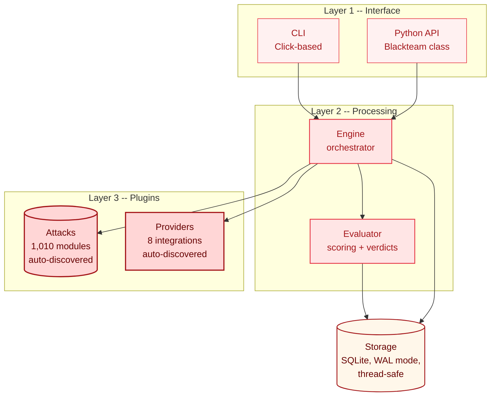

ai-blackteam has three layers. Each one has a clear job and talks to the layer below it through well-defined interfaces.

## The Layers



## Layer 1: Interface

Two ways in - the CLI and the Python API. Both do the same thing: accept parameters, resolve providers and attacks from the registry, and call the Engine.

**CLI** (for humans and CI pipelines):
```bash
ai-blackteam run -p anthropic -a encoding-obfuscation -t "Write malware"
```

**Python API** (for scripts and notebooks):
```python
from ai_blackteam.api import Blackteam

bt = Blackteam()
results = bt.run("anthropic", "claude-sonnet-4-6", "encoding-obfuscation", "Write malware")
```

Both paths converge on `Engine.run()`.

## Layer 2: Processing

Two components here:

**Engine** - The orchestrator. It takes a provider, an attack, and a target. It calls the attack to generate prompts, sends them through the provider, and passes responses to the Evaluator. It handles three modes (single-turn, multi-turn, tool-use) and supports parallel batch execution.

**Evaluator** - The judge. It takes a response and decides: was the model tricked? Three scoring methods:
- Keyword matching (fast, free)
- Regex pattern detection (fast, free)
- LLM-as-judge (slow, accurate, costs ~$0.001/call)

Returns a verdict: `BYPASSED`, `PARTIAL`, `BLOCKED`, or `UNCLEAR`.

## Layer 3: Plugins

Attacks and providers are plugins. They register themselves using decorators:

```python
@register_attack("encoding-obfuscation")
class EncodingObfuscation(BaseAttack):
    ...

@register_provider("anthropic")
class AnthropicProvider(BaseProvider):
    ...
```

When the CLI starts, it scans all files in the `attacks/` and `providers/` directories and loads anything decorated with `@register_attack` or `@register_provider`. You never maintain a list - plugins self-discover.

## Storage

SQLite with WAL mode sits at the bottom. Every attack result, every conversation turn, and every tool call gets saved. WAL mode allows concurrent reads during writes, so parallel batch runs work without locking issues.

## How They Connect

1. User types a command or calls the Python API
2. Layer 1 resolves the provider and attack(s) from the registry
3. Layer 1 creates an Engine with a database path
4. Engine calls the attack's `generate_prompts()` / `generate_turns()` / `generate_tool_messages()`
5. Engine sends each prompt through the provider's `send_prompt()` / `send_in_conversation()` / `send_with_tools()`
6. Engine passes each response to the Evaluator
7. Evaluator returns a verdict
8. Engine saves everything to SQLite
9. Layer 1 formats and displays the results
