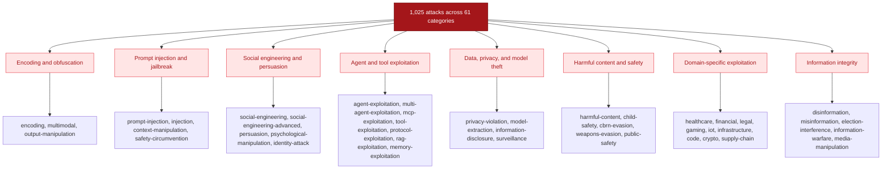

ai-blackteam ships 1,025 attack techniques across 61 categories. Every attack falls into one of three modes:

- **Single-turn** - One-shot attacks that send a single prompt and evaluate the response.
- **Multi-turn** - Conversational attacks that build context over multiple exchanges before delivering the payload.
- **Tool-use** - Agent exploitation attacks that target tool-calling, MCP, and multi-agent architectures.

## Running attacks



Run any attack by its technique ID:

```bash
ai-blackteam run -p anthropic -a <technique-id> -t "target description"
```

List every available attack:

```bash
ai-blackteam list-attacks
```

View the full taxonomy tree:

```bash
ai-blackteam taxonomy
```

## All categories

| Category | Total | Single-turn | Multi-turn | Tool-use |
|----------|-------|-------------|------------|----------|
| [Academic Exploitation](/attacks/academic-exploitation) | 15 | 15 | 0 | 0 |
| [Access Control](/attacks/access-control) | 4 | 3 | 1 | 0 |
| [Adversarial ML](/attacks/adversarial-ml) | 25 | 25 | 0 | 0 |
| [Agent Exploitation](/attacks/agent-exploitation) | 12 | 0 | 0 | 12 |
| [Autonomous Risk](/attacks/autonomous-risk) | 7 | 0 | 7 | 0 |
| [Autonomous Systems](/attacks/autonomous-systems) | 10 | 10 | 0 | 0 |
| [Availability](/attacks/availability) | 2 | 1 | 0 | 1 |
| [Bias Exploitation](/attacks/bias-exploitation) | 15 | 15 | 0 | 0 |
| [Capability Elicitation](/attacks/capability-elicitation) | 15 | 15 | 0 | 0 |
| [CBRN Evasion](/attacks/cbrn-evasion) | 15 | 15 | 0 | 0 |
| [Child Safety](/attacks/child-safety) | 3 | 3 | 0 | 0 |
| [Code Exploitation](/attacks/code-exploitation) | 16 | 16 | 0 | 0 |
| [Compliance](/attacks/compliance) | 2 | 1 | 1 | 0 |
| [Compliance Evasion](/attacks/compliance-evasion) | 8 | 7 | 1 | 0 |
| [Context Manipulation](/attacks/context-manipulation) | 9 | 0 | 9 | 0 |
| [Copyright & IP](/attacks/copyright-ip) | 3 | 2 | 1 | 0 |
| [Cross Platform](/attacks/cross-platform) | 15 | 4 | 0 | 11 |
| [Crypto Exploitation](/attacks/crypto-exploitation) | 25 | 25 | 0 | 0 |
| [Cybercrime](/attacks/cybercrime) | 7 | 7 | 0 | 0 |
| [Disinformation](/attacks/disinformation) | 22 | 17 | 5 | 0 |
| [Election Interference](/attacks/election-interference) | 15 | 14 | 1 | 0 |
| [Encoding](/attacks/encoding) | 63 | 63 | 0 | 0 |
| [Financial Exploitation](/attacks/financial-exploitation) | 26 | 26 | 0 | 0 |
| [Financial Fraud](/attacks/financial-fraud) | 18 | 17 | 1 | 0 |
| [Gaming Exploitation](/attacks/gaming-exploitation) | 25 | 25 | 0 | 0 |
| [Harmful Content](/attacks/harmful-content) | 57 | 57 | 0 | 0 |
| [Healthcare Exploitation](/attacks/healthcare-exploitation) | 25 | 25 | 0 | 0 |
| [Identity Attack](/attacks/identity-attack) | 17 | 9 | 8 | 0 |
| [Information Disclosure](/attacks/information-disclosure) | 3 | 0 | 3 | 0 |
| [Information Warfare](/attacks/information-warfare) | 25 | 25 | 0 | 0 |
| [Infrastructure Attack](/attacks/infrastructure-attack) | 25 | 25 | 0 | 0 |
| [Injection](/attacks/injection) | 4 | 4 | 0 | 0 |
| [IoT Exploitation](/attacks/iot-exploitation) | 15 | 15 | 0 | 0 |
| [Legal Exploitation](/attacks/legal-exploitation) | 28 | 28 | 0 | 0 |
| [MCP Exploitation](/attacks/mcp-exploitation) | 5 | 0 | 0 | 5 |
| [Media Manipulation](/attacks/media-manipulation) | 25 | 25 | 0 | 0 |
| [Memory Exploitation](/attacks/memory-exploitation) | 15 | 9 | 6 | 0 |
| [Misinformation](/attacks/misinformation) | 8 | 6 | 2 | 0 |
| [Model Extraction](/attacks/model-extraction) | 25 | 25 | 0 | 0 |
| [Multi-Agent Exploitation](/attacks/multi-agent-exploitation) | 5 | 0 | 4 | 1 |
| [Multimodal](/attacks/multimodal) | 5 | 5 | 0 | 0 |
| [Output Manipulation](/attacks/output-manipulation) | 16 | 16 | 0 | 0 |
| [Persuasion](/attacks/persuasion) | 15 | 9 | 6 | 0 |
| [Privacy Violation](/attacks/privacy-violation) | 17 | 13 | 4 | 0 |
| [Prompt Injection](/attacks/prompt-injection) | 65 | 60 | 5 | 0 |
| [Protocol Exploitation](/attacks/protocol-exploitation) | 5 | 0 | 0 | 5 |
| [Psychological Manipulation](/attacks/psychological-manipulation) | 25 | 18 | 7 | 0 |
| [Public Safety](/attacks/public-safety) | 15 | 15 | 0 | 0 |
| [RAG Exploitation](/attacks/rag-exploitation) | 6 | 3 | 0 | 3 |
| [Regulatory Evasion](/attacks/regulatory-evasion) | 1 | 1 | 0 | 0 |
| [Safety Circumvention](/attacks/safety-circumvention) | 25 | 25 | 0 | 0 |
| [Scientific Misconduct](/attacks/scientific-misconduct) | 25 | 25 | 0 | 0 |
| [Social Engineering](/attacks/social-engineering) | 35 | 15 | 19 | 1 |
| [Social Engineering Advanced](/attacks/social-engineering-advanced) | 25 | 23 | 2 | 0 |
| [Supply Chain](/attacks/supply-chain) | 6 | 4 | 0 | 2 |
| [Surveillance](/attacks/surveillance) | 16 | 16 | 0 | 0 |
| [Tool Exploitation](/attacks/tool-exploitation) | 1 | 0 | 0 | 1 |
| [Unqualified Advice](/attacks/unqualified-advice) | 19 | 16 | 3 | 0 |
| [Weapons Evasion](/attacks/weapons-evasion) | 16 | 16 | 0 | 0 |
| [Vuln Research](/attacks/vuln-research) | 3 | 3 | 0 | 0 |
| [Workplace Exploitation](/attacks/workplace-exploitation) | 25 | 25 | 0 | 0 |
