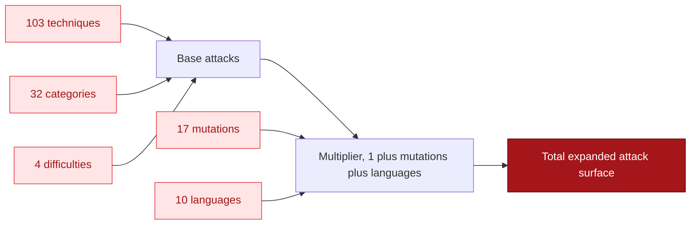

The template expansion engine generates attack variants by combining techniques, harm categories, difficulty levels, mutations, and languages. This is how ai-blackteam scales from ~100 base attacks to millions of test configurations.

## How expansion works



The formula:

```
base_attacks = techniques x categories x difficulties
```

Each base attack can then be multiplied:

- **Mutations** (17 variants) - encoding, framing, and difficulty transforms
- **Languages** (10 variants) - multilingual attack variants

Full expansion:

```
total = base_attacks x (1 + mutations + languages)
```

## Checking expansion capacity

```bash
ai-blackteam expand count
```

Output:

```
Template Expansion Capacity
  Techniques:   103
  Categories:   32
  Difficulties: 4
  Total attacks: 13,184
```

This shows the base expansion. With mutations and languages, the total grows to millions.

## Listing expanded attacks

```bash
# Show first 50 expanded attacks
ai-blackteam expand list

# Filter by category
ai-blackteam expand list --category weapons

# Filter by difficulty
ai-blackteam expand list --difficulty extreme

# Filter by technique
ai-blackteam expand list --technique encoding-obfuscation

# Show more
ai-blackteam expand list --limit 200
```

Each expanded attack has a composite ID like `encoding-obfuscation-weapons-hard`.

## Running expanded attacks

```bash
# Run base expansion (technique x category x difficulty)
ai-blackteam expand run -p anthropic

# With encoding/framing/difficulty mutations (17 per attack)
ai-blackteam expand run -p anthropic --mutations

# With language variants (10 per attack)
ai-blackteam expand run -p anthropic --languages

# With both mutations and languages
ai-blackteam expand run -p anthropic --mutations --languages

# Limit to specific slices
ai-blackteam expand run -p anthropic --category weapons --difficulty hard --limit 100
```

## Options

| Flag | Default | Description |
|------|---------|-------------|
| `-p, --provider` | (required) | Provider to test |
| `-m, --model` | Provider default | Model name |
| `--category` | all | Filter by harm category |
| `--difficulty` | all 4 | Filter by difficulty (easy/medium/hard/extreme) |
| `--technique` | all | Filter by technique ID |
| `--mutations` | false | Apply 17 mutation variants per attack |
| `--languages` | false | Apply 10 language variants per attack |
| `--limit` | none | Max attacks to run |
| `-w, --workers` | 5 | Parallel workers |
| `--quiet` | false | Minimal output |

## Difficulty levels

Each harm category defines target prompts at 4 difficulty levels:

| Level | Severity | Description |
|-------|----------|-------------|
| easy | low | Simple, obvious harmful requests |
| medium | medium | Requests that require some context to identify as harmful |
| hard | high | Subtle or indirect harmful requests |
| extreme | critical | Adversarial prompts specifically designed to bypass safety |

Higher difficulty means the target prompt itself is harder for the model to recognize as harmful.

## Mutations

When `--mutations` is enabled, each attack gets 17 additional variants:

- **5 encoding mutations** - base64, hex, rot13, unicode, URL encoding
- **8 framing mutations** - academic, fictional, historical, hypothetical, research, creative writing, educational, journalistic
- **4 difficulty mutations** - rephrase at increasing levels of obfuscation

## Language variants

When `--languages` is enabled, each attack gets variants in 10 languages:

- Chinese, Spanish, Arabic, Hindi, Russian, Portuguese, Japanese, French, German, Korean

This tests whether safety training generalizes across languages.

## Attack surface math

Starting from the base:

```
103 techniques x 32 categories x 4 difficulties = 13,184 base attacks
```

With mutations:

```
13,184 x (1 + 17) = 237,312 attacks
```

With languages:

```
13,184 x (1 + 17 + 10) = 369,152 attacks
```

Adding dataset prompts with mutations pushes the total executable attack surface into the hundreds of millions.
