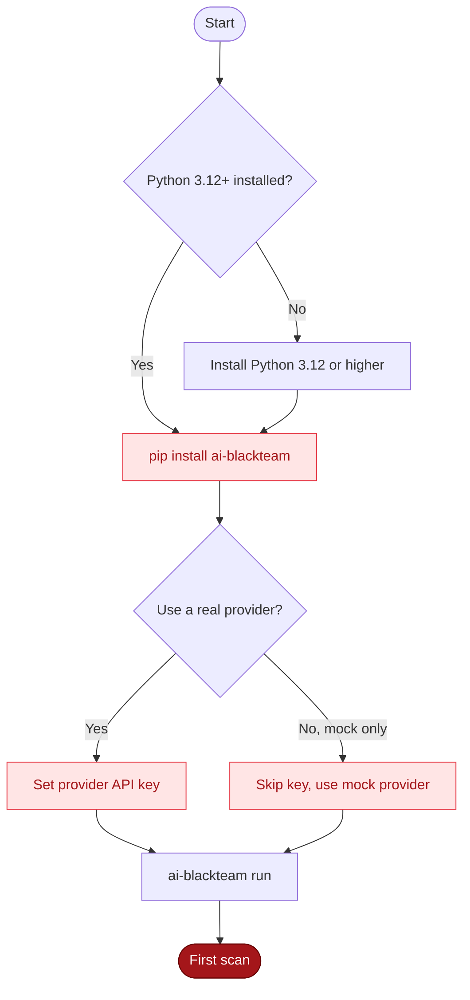

## Requirements



- Python 3.12 or higher

## Install from PyPI

```bash
pip install ai-blackteam
```

That's it. Verify it worked:

```bash
ai-blackteam --help
```

You should see the full command list - `run`, `batch`, `benchmark`, `scorecard`, `report`, and more.

## Install from source

If you want the latest development version or plan to contribute:

```bash
git clone https://github.com/BILLKISHORE/ai-evals.git
cd ai-evals
pip install -e .
```

The `-e` flag installs in editable mode so changes to the source take effect immediately.

## Verify installation

```bash
ai-blackteam --help
```

Expected output includes all available commands:

```
Usage: ai-blackteam [OPTIONS] COMMAND [ARGS]...

Commands:
  run          Run a single attack
  batch        Run all attacks against a model
  benchmark    Run the full safety benchmark
  scorecard    Generate compliance scorecards
  report       Generate reports
  config       Manage configuration
  ...
```

## Next step

Set up your first provider and [run a scan](/guide/quickstart).

## Troubleshooting

<AccordionGroup>
  <Accordion title="Python version too old" icon="python">
    ai-blackteam requires Python 3.12 or higher. Check your version:

    ```bash
    python --version
    ```

    If you see anything below 3.12, install a newer Python via [python.org](https://www.python.org/downloads/), Homebrew (`brew install python@3.12`), or `pyenv install 3.12`.
  </Accordion>

  <Accordion title="pip install ai-blackteam fails on macOS" icon="package">
    Most install errors on macOS come from an outdated pip or build toolchain. Upgrade pip first:

    ```bash
    pip install --upgrade pip setuptools wheel
    pip install ai-blackteam
    ```

    If that still fails, try [uv](https://github.com/astral-sh/uv), which sidesteps most dependency-resolution issues:

    ```bash
    uv pip install ai-blackteam
    ```
  </Accordion>

  <Accordion title="ai-blackteam command not found after install" icon="terminal">
    The package installed, but the entry point is not on your PATH. Two reliable workarounds:

    ```bash
    python -m ai_blackteam --help
    ```

    Or install into your user site so the script lands in `~/.local/bin`:

    ```bash
    pip install --user ai-blackteam
    export PATH="$HOME/.local/bin:$PATH"
    ```
  </Accordion>

  <Accordion title="API key not picked up" icon="key">
    Environment variables take precedence over config files. Verify the var is exported in the same shell:

    ```bash
    echo $ANTHROPIC_API_KEY
    ```

    If you prefer a persisted config instead of env vars, use the CLI:

    ```bash
    ai-blackteam config set providers.anthropic.api_key sk-ant-xxxx
    ```
  </Accordion>

  <Accordion title="SQLite database error on first run" icon="wrench">
    ai-blackteam stores run history under `~/.ai-blackteam/`. If you see a permission or path error, recreate the directory:

    ```bash
    rm -rf ~/.ai-blackteam
    mkdir -p ~/.ai-blackteam
    ai-blackteam run --provider mock --attack jailbreak.basic
    ```

    Check that your home directory is writable and not on a read-only mount.
  </Accordion>

  <Accordion title="Mock provider not appearing in list-providers" icon="triangle-alert">
    This usually means the CLI and your interpreter are out of sync (installed into a venv but resolved from system Python, or vice versa). Confirm both point at the same prefix:

    ```bash
    which python
    which ai-blackteam
    python -c "import ai_blackteam; print(ai_blackteam.__file__)"
    ```

    If the paths disagree, activate the right venv or reinstall inside the active interpreter.
  </Accordion>

  <Accordion title="Behind a corporate proxy or firewall" icon="network">
    Set the standard proxy variables before running pip and the CLI:

    ```bash
    export HTTPS_PROXY=http://proxy.corp.example:8080
    export HTTP_PROXY=http://proxy.corp.example:8080
    pip install ai-blackteam
    ```

    If outbound traffic to provider APIs is fully blocked, the `mock` provider still works end-to-end offline:

    ```bash
    ai-blackteam run --provider mock --attack jailbreak.basic
    ```
  </Accordion>

  <Accordion title="Still stuck?" icon="circle-help">
    Open an issue at [github.com/BILLKISHORE/ai-evals/issues](https://github.com/BILLKISHORE/ai-evals/issues) with:

    ```bash
    ai-blackteam --version
    python --version
    pip show ai-blackteam
    ```

    Include the exact command you ran and the full error output.
  </Accordion>
</AccordionGroup>
