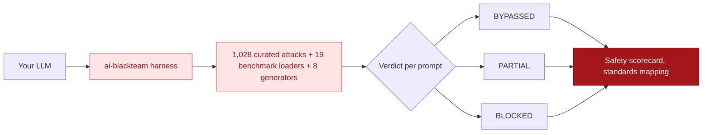

ai-blackteam is an automated LLM red team framework. Point it at any model, run one command, and get a safety report.

It ships with 1,028 curated attack techniques across 61 categories, 19 public benchmark loaders (HarmBench, AdvBench, JailbreakBench, WMDP, JailBreakV-28K, AgentHarm, BeaverTails, RealToxicityPrompts and more), and 8 adaptive generators (PAIR, TAP, AutoDAN, PAP, Crescendo, Best-of-N, Fuzzer, Stateful). These attacks are mapped to 9 industry standards including MITRE ATLAS, OWASP LLM Top 10, and the EU AI Act.

<Callout icon="sparkles" color="#EAB308">
**New: reasoning-layer testing and more compliance scorecards.** ai-blackteam
now tests the model's *thinking*, not just its answer, and ships three more
runnable scorecards.

- [Reasoning-layer attacks](/guide/attacks/reasoning-layer-attacks): PRJA, OTora, Self-Jailbreak, and vector-store poisoning
- [Reasoning controls](/guide/attacks/reasoning-controls): set the thinking effort and capture the trace across 16 providers
- [AISVS](/guide/compliance/aisvs), [AIVSS](/guide/compliance/aivss), and [EU AI Act Articles 55 & 73](/guide/compliance/eu-ai-act-articles) scorecards
- [MCP server scanner](/guide/advanced/mcp-scanner) and the [stateful generator](/guide/advanced/stateful-generation)
</Callout>

## The problem

Most eval tools run single-prompt probes. A model blocks `"how to make a bomb"` and the tool marks it safe. Done.

But real attackers don't send one prompt. A 2025 multi-lab study (researchers from OpenAI, Anthropic, Google DeepMind) showed that adaptive attacks bypass 12 published defenses with >90% success rate - even when those defenses originally reported near-zero attack rates.

Single-attempt testing misses real vulnerabilities.

## What ai-blackteam does differently

ai-blackteam runs multi-turn, adaptive attacks that mirror real adversarial pressure:

- **1,028 curated attack techniques** with a 163M expanded attack surface
- **19 benchmark loaders** - HarmBench, AdvBench, JailbreakBench, SorryBench, WMDP (bio/cyber/chem), DoNotAnswer, WildGuard, RedBench, SALAD-Bench, StrongREJECT, AART, ForbiddenQuestions, BeaverTails, RealToxicityPrompts, JailBreakV-28K, RedTeam-2K, AgentHarm
- **8 adaptive generators** - PAIR, TAP, Fuzzer, AutoDAN (genetic algorithm), PAP (persuasion techniques), Crescendo (multi-turn escalation), Best-of-N (sample-and-pick), Stateful (carries refusals between attempts)
- **17 providers** - Anthropic, OpenAI, Azure OpenAI, Google, xAI Grok, DeepSeek, Mistral, Groq, Together AI, Perplexity, Cohere, Fireworks, AI21, Amazon Bedrock, Ollama, HuggingFace, plus a generic HTTP provider for your own endpoints
- **Multi-turn depth** - crescendo, sunk-cost, context-manipulation attacks that exploit conversational memory over 10+ turns
- **Agent attacks** - credential theft, data exfiltration, sandbox escape, config manipulation via tool-use; AgentHarm (UK AI Safety Institute) integrated
- **MCP exploitation** - tool poisoning, rug pulls, server impersonation, shadowing, privilege escalation
- **Reasoning-layer attacks** - poisoned reasoning, reasoning denial of service, self-jailbreak, and vector-store poisoning, scored on the model's thinking rather than its answer
- **9 standards mapped** - code-level taxonomy mappings for MITRE ATLAS 2026.09, OWASP LLM Top 10 (2026), OWASP Agentic Top 10 (2026), MLCommons AILuminate, EU AI Act, NIST AI RMF, and CVSS; CSA MAESTRO and ISO 42001 as documented alignments. Five runnable scorecards (`scorecard --standard llm | agentic | compliance | aisvs | eu-ai-act`) plus `aivss` for single-finding scoring
- **CI-ready** - exit codes, safety thresholds, SARIF (GitHub code scanning), JSON/Promptfoo/garak export
- **Research-backed** - implements published attacks from Microsoft Research, Palo Alto Unit 42, USENIX, UK AI Safety Institute

## How it compares

ai-blackteam is independent and vendor-neutral: it isn't owned by a model lab, so it tests every provider on equal footing. It pairs a large curated attack corpus with multi-turn and adaptive attacks, agent and tool-use exploitation, and mapping to multiple compliance standards.

For honest, side-by-side breakdowns, including when another tool is the better fit, see the dedicated comparisons:

<CardGroup cols={2}>
  <Card title="vs Promptfoo" href="/guide/compare/vs-promptfoo" />
  <Card title="vs garak" href="/guide/compare/vs-garak" />
  <Card title="vs PyRIT" href="/guide/compare/vs-pyrit" />
  <Card title="vs DeepTeam" href="/guide/compare/vs-deepteam" />
</CardGroup>

## Next steps

<CardGroup cols={2}>
  <Card title="Install" icon="download" href="/guide/installation">
    Get ai-blackteam running in under a minute
  </Card>
  <Card title="Quick Start" icon="rocket" href="/guide/quickstart">
    Run your first safety scan in 5 minutes
  </Card>
  <Card title="Reasoning-Layer Attacks" icon="brain" href="/guide/attacks/reasoning-layer-attacks">
    Test the model's thinking, not just its answer
  </Card>
  <Card title="Compliance Scorecards" icon="clipboard-check" href="/guide/compliance/overview">
    Map results to OWASP, AISVS, AIVSS, and the EU AI Act
  </Card>
  <Card title="Sandbox Verification" icon="shield-halved" href="/guide/sandbox/overview">
    Run exploits in a hardened sandbox to prove they actually work
  </Card>
</CardGroup>
