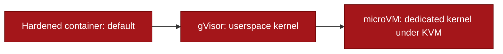

## Layers

Every run is contained by independent controls, so one failure does not end the whole containment.

| Control | What it does |
|---------|--------------|
| Default-deny egress | `--network none`, no path to the internet |
| Non-root | runs as uid 65534, no capabilities (`--cap-drop ALL`) |
| Read-only rootfs | the filesystem cannot be written; a work dir is a `noexec` tmpfs |
| Resource caps | CPU, memory, pids, and a hard wall-clock timeout with a kill switch |
| Seccomp | Docker's default profile, or a strict allowlist you configure |
| Verified destruction | the container and network are confirmed gone after each run |
| Audit log | a per-run record of the whole chain |
| Image attestation | pin images by sha256 digest, verify signatures (cosign), run by digest |

The sandbox fails closed: if any control cannot be established, it returns UNVERIFIED instead of running the code.

## Runtime tiers

On plain Docker the container shares the host kernel, so a kernel privilege-escalation zero-day is an escape. The runtime is selectable to close that:



- **Hardened container** (default): the controls above on the host runtime.
- **gVisor** (`runtime="gvisor"`): a userspace kernel intercepts every syscall; an escape reaches the userspace kernel, not the host.
- **microVM** (`runtime="kata"`): each run gets its own Linux kernel inside KVM; an attacker must break the guest kernel and the hypervisor.

```python
DockerVerifier(runtime="gvisor")   # userspace kernel
DockerVerifier(runtime="kata")     # dedicated kernel per run
```

gVisor and microVM need a Linux host with KVM. The repo ships `scripts/provision-sandbox-host.sh` and a runbook to set them up and prove containment on each tier.

## Languages

Python, bash, and C exploits run. C compiles on a toolchain image inside a separate exec-able tmpfs so the main work dir stays `noexec`. Other languages return UNVERIFIED.
